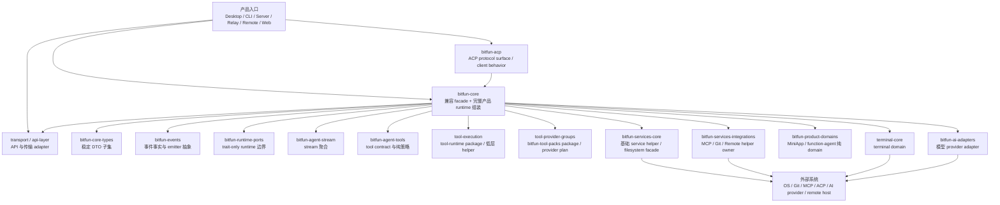
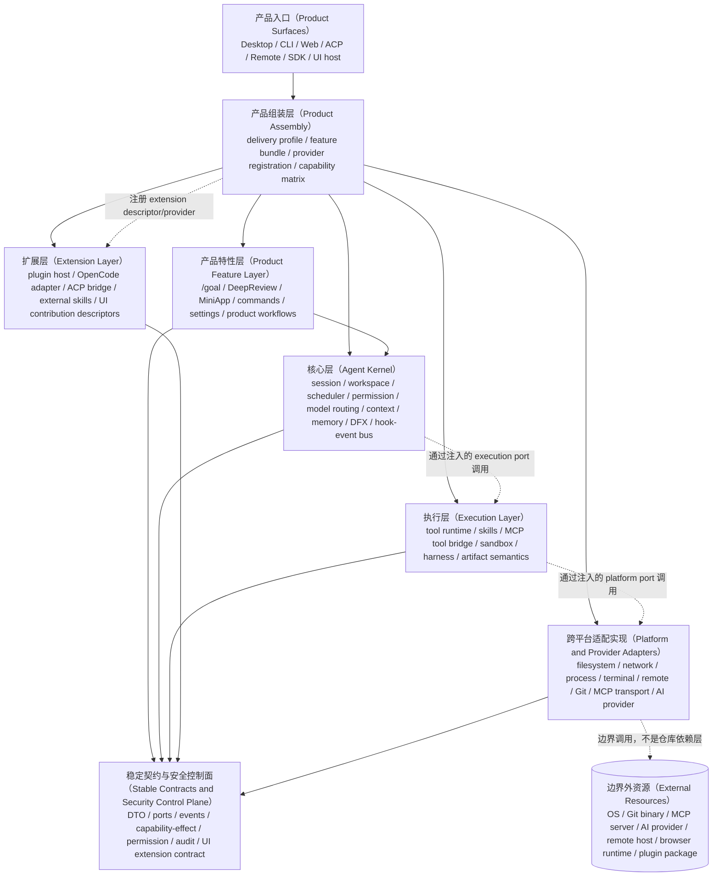

# BitFun Core 拆解架构

本文描述 BitFun core runtime 拆解的稳定设计：先说明设计建立时的初始状态，再定义目标状态的逻辑分层、
接口与实现分离、扩展方式、安全边界和风险约束。本文只描述架构设计本身，不记录阶段进度；执行计划见
[`../plans/core-decomposition-plan.md`](../plans/core-decomposition-plan.md)，详细接口和 crate 内部设计见
[`agent-runtime-services-design.md`](agent-runtime-services-design.md)。

## 1. 背景与目标

设计建立时，BitFun 已经从 `bitfun-core` 中抽出了若干 owner crate，但 `bitfun-core` 仍承担兼容 facade、
完整产品 runtime 组装、agent loop、service 接线、tool materialization、产品命令适配和部分 product domain
adapter。该初始形态具备运行能力，但会让架构演进持续面临三个问题：

- 产品特性、Agent 内核、平台实现和具体 service 接线混在同一条路径中。
- Desktop、CLI、Server、Remote、ACP、Web 和未来 SDK 容易被完整 `bitfun-core/product-full` 牵引。
- Tool、MCP、ACP、subagent、skills、harness、plugin、hook 和 UI 扩展缺少统一分层归属。

目标状态不是将所有能力迁入一个新的巨型 `AgentRuntime` crate，而是将 BitFun 拆成可组合的产品架构：

- **Agent Kernel** 提供稳定、可嵌入、平台无关的 Agent 能力，包括 session / workspace、长程任务、调度、
  权限、模型调度、上下文、记忆、DFX、hook 和 event。
- **Product Feature** 负责把内核能力组装为用户可见功能。例如长程任务支持属于内核，`/goal` 命令、设置项、
  UI 展示和默认策略属于产品特性。
- **Execution / Extension / Platform Adapter** 分别承接工具执行、生态扩展和跨平台实现，避免内核直接依赖
  Tauri、UI、MCP client、SSH、filesystem manager 或 provider concrete。
- **Product Assembly** 是 composition root，按 Desktop、CLI、Web、ACP、Remote、SDK 等形态选择 feature、
  Rust kernel provider、UI contribution、插件扩展和平台实现。

目标状态必须保持产品行为、默认能力集合、权限语义、工具曝光、事件语义、session 生命周期、remote 行为和
release 构建形态等价。任何会改变功能边界的设计变更都必须先单独评审。

## 2. 架构原则

- **内核与特性分离**：Agent Kernel 只拥有平台无关的固化 Agent 逻辑和扩展机制；用户侧命令、UI、设置、
  feature 默认策略和产品文案属于 Product Feature / Product Assembly。
- **依赖单向流动**：产品入口和组装允许依赖下层，内核、执行、扩展、跨平台适配和契约层不得反向读取产品入口、
  UI state、Tauri handle 或 delivery profile。
- **接口与实现分离**：接口属于稳定契约、Kernel API、Runtime Services、Tool / Harness contract 或 UI
  extension contract；具体实现属于 Product Assembly 注册边界、extension host、protocol adapter 或
  cross-platform adapter。
- **Product API 覆盖 Rust 与 UI**：BitFun API 不应仅指 Rust 后端 API。目标状态需要同时提供 Rust Kernel API
  和 UI Extension API，再由 OpenCode / ACP / plugin adapter 映射到外部生态 API。
- **扩展只产出受控候选效果**：plugin、OpenCode adapter、MCP、skills 和 hooks 通过声明式契约贡献事件订阅、UI
  contribution、tool、prompt、permission candidate 或 workflow provider，但授权、状态写入、审计和最终执行
  仍由内核事实与安全控制面决定。
- **外部系统只在边界被调用**：OS、Git、MCP server、AI provider、remote host、browser/desktop 环境是仓库外部
  系统。它们由跨平台或协议 adapter 调用，不作为服务层上游依赖写入核心逻辑视图。
- **feature group 不等于产品能力**：feature group 是 Cargo 构建边界，CapabilitySet 是运行时产品能力边界。
  两者必须由 Product Assembly 显式映射。

## 3. 初始状态逻辑视图

初始状态的核心事实是：多个 crate 已经承接稳定类型、事件、stream、tool contract、部分 service helper 和
product domain 纯逻辑，但完整运行时仍以 `bitfun-core` 为中心。



初始状态主要问题：

- `bitfun-core` 仍是事实上的 runtime owner，产品命令、service wiring、tool registry、manager handle 和兼容导出
  交叉存在。
- 产品特性没有与内核能力分层。例如 `/goal`、DeepReview、MiniApp、custom agent、tool exposure 同时触达 UI、
  Rust runtime、tool、service 和权限。
- 现有六层物理目录有助于控制依赖，但不能直接表达 Product Feature、Agent Kernel、Extension Host 和
  Cross-platform Adapter 的目标关系。
- 适配层与服务层描述偏实现目录，不能清楚区分 protocol/provider translation、OS/service implementation、
  UI extension API 和外部生态 adapter。
- 安全边界散落在 SDLC Harness、tool permission、MCP、hook、shell、网络和平台执行路径中，缺少贯穿内核、
  执行、扩展和 UI 投影的一致控制面。
- `product-full` 是完整产品能力的安全网，不是最终按产品形态和 feature bundle 拆分的能力矩阵。
- Agent Runtime SDK 仍缺少可对外稳定承诺的统一 facade、事件流协议、provider 注册边界、UI/API 扩展契约和
  最小依赖构建形态。

## 4. 对照分析

本节只提炼对 BitFun 分层有用的架构信号，不把其他项目的实现形态直接复制到 BitFun。

### 4.1 Claude Code

Claude Code 官方文档把 Agent SDK、hooks、slash commands、subagents、MCP、permissions 和 sessions 作为可组合
能力暴露；hooks 在生命周期事件上触发，permission / settings 管理工具使用和团队配置，slash commands 通过 SDK
控制 session。该结构表明，用户可见命令、Agent Kernel、权限、MCP、skills 和 hooks 能够通过稳定 API 组合，而不是混在
同一个 runtime owner 中。

对 BitFun 的设计结论：

- 长程任务、session、权限、事件、hook 和 tool 调度属于内核能力；`/goal`、`/plan`、设置项和 UI 展示属于特性组装。
- SDK 边界必须暴露稳定 builder / runner / event stream / permission / session API，而不是要求调用方理解产品命令。
- hooks 能改变行为时必须有顺序、timeout、错误策略和安全审计；不得只是事件通知。

### 4.2 OpenCode

OpenCode 官方文档展示了 terminal、desktop、IDE、server 和 SDK 多入口；agents / subagents 可配置 prompt、model 和
tool access；tools 通过 permission 控制并可由 custom tools 或 MCP 扩展；plugins 可 hook 到事件并扩展行为；server
暴露 OpenAPI/SDK 供外部控制。

对 BitFun 的设计结论：

- OpenCode adapter 不应仅绑定 Rust 内核。它需要映射 BitFun 的 Rust Kernel API、UI Extension API、tool / MCP /
  skills / plugin contract 和安全能力声明。
- 插件扩展范围覆盖 UI 和内核能力，但只能通过 Product Assembly 注册到明确的 feature / capability；不能直接持有产品状态或
  绕过安全边界。
- API 需要按层暴露，避免把所有能力集中到单一 `bitfun-core` 或单一后端 API crate。

### 4.3 Codex

Codex 官方文档把 sandbox、approval、network control 和 auto-review 放在 agent 操作安全模型中，而不是把所有确认
都交给 UI 或模型判断。对 BitFun 而言，权限确认、沙箱、网络、凭据、插件执行域和远程执行域必须由稳定控制面表达，
再由产品入口投影给用户。

### 4.4 对照结论

Claude Code、OpenCode 和 Codex 的共同信号不是“所有能力放入一个 runtime”，而是把 agent 内核、安全控制、
扩展声明、工具执行和平台 provider 分开。用户可见功能通过命令、设置、UI contribution 或 SDK API 组装；外部插件
通过 descriptor、hook、tool provider 或 MCP/ACP bridge 接入；OS、network、remote、browser 和 provider client
留在边界 adapter 中。BitFun 的目标架构也应遵循这一点：Product Assembly 负责组装 concrete provider，普通层级
只消费稳定 API、port 和 capability/effect contract。

## 5. 目标逻辑视图

目标逻辑按概念层表达。概念层决定职责、接口和依赖方向；物理目录决定 crate 的放置位置。二者必须一致，但不要求
一层只对应一个 crate。

本图区分两类关系：

- **编译依赖**：普通模块只能依赖本层公开 API、下层稳定契约或被注入的 port，不直接依赖更底层 concrete 实现。
- **组装依赖**：Product Assembly 是 composition root，允许在构建期认识具体 feature、kernel、execution、
  extension 和 platform provider，并把它们装配为 typed runtime parts。

外部系统不是仓库内层级。OS、Git、MCP server、AI provider、remote host、browser/desktop runtime 和 plugin
package 都是边界外资源，只能由被注入的跨平台或协议 adapter 调用。



普通模块的依赖方向只允许流向稳定接口，而不是直接认识所有下层实现：

```text
Product Surfaces
  -> Product Assembly API
Product Assembly
  -> Product Feature API / Agent Kernel API / Execution API / Extension API / Platform Provider API
Product Feature
  -> Agent Kernel API / Stable Contracts and Security Control Plane
Agent Kernel
  -> Stable Contracts and Security Control Plane
Execution
  -> Stable Contracts and Security Control Plane
Extension
  -> Stable Contracts and Security Control Plane
Platform and Provider Adapters
  -> Stable Contracts and Security Control Plane
```

运行时调用可以通过 Product Assembly 注入的 typed port 从 Kernel 进入 Execution、从 Execution 进入 Platform
provider，但这不是对 concrete crate 的编译依赖。除 Product Assembly 外，任何层都不应为了“方便调用”直接依赖下层
concrete implementation。外部系统只存在于 adapter 的 I/O 边界，不参与仓库内层级依赖。

同层 crate 之间也必须按 owner 最小化依赖，禁止为了复用 helper 形成循环依赖或让下层读取产品形态。

## 6. 层级放置规则

### 6.1 产品组装与接口层（Product Assembly and Interfaces）

放置 Desktop、CLI、Server、Remote、ACP、Web、Mobile Web、Installer、E2E 和 SDK 入口相关代码。该层负责选择
`DeliveryProfile`、feature bundle、capability matrix、Rust provider、UI contribution、extension host 和
platform provider，并把它们组装成产品可用能力。

当前主要路径：`src/apps/*`、`src/web-ui`、`src/mobile-web`、`BitFun-Installer`、`tests/e2e`、
`src/crates/interfaces`、`src/crates/assembly/core` 和 `src/crates/assembly/product-capabilities`。

应该放这里：

- 产品入口、host adapter、UI host、Tauri command、CLI command、HTTP/transport entrypoint、ACP surface。
- 产品形态选择、feature bundle 选择、capability matrix、provider 注册和 unsupported/unavailable 映射。
- UI contribution 的渲染 host、输入框命令入口、产品命令到 runtime request 的映射。

不应该放这里：

- Agent session/turn/scheduler 的状态机。
- Tool、MCP、filesystem、terminal、remote、AI provider 的通用实现。
- 可被 SDK 独立复用的内核 API 语义。

### 6.2 产品特性层（Product Feature Layer）

放置把底层能力组合成用户功能的逻辑。产品特性可以同时有 Rust 编排、UI contribution、命令入口和默认策略，
但它只编排能力，不拥有内核状态机或平台实现。

当前主要路径：`src/crates/assembly/product-capabilities`、`src/crates/contracts/product-domains`、部分
`src/web-ui` feature host、app command adapter，以及迁移期 `bitfun-core` 兼容路径。

应该放这里：

- `/goal`、DeepReview、DeepResearch、MiniApp、input command、settings、review UI、custom agent/mode 的产品编排。
- feature pack / capability pack、默认策略、UI contribution descriptor、命令到 kernel request 或稳定 descriptor 的映射。
- 特性级 DTO 和纯规则，例如 MiniApp domain contract、review report domain contract。

不应该放这里：

- 长程任务生命周期、session/workspace 状态、scheduler、permission decision、event queue。
- Tool/MCP/sandbox 的实际执行、filesystem/terminal/remote 的具体实现。
- 依赖某个产品形态的 UI 组件实现；特性只声明 descriptor，由入口层渲染。

### 6.3 核心层（Agent Kernel）

放置平台无关、产品形态无关的 Agent 固化逻辑。该层是未来 Agent Runtime SDK 的核心候选边界。

当前主要路径：`src/crates/execution/agent-runtime`、`src/crates/execution/agent-stream`、
`src/crates/execution/runtime-services`、`src/crates/contracts/runtime-ports`、`src/crates/contracts/events` 和
`src/crates/contracts/core-types`。

应该放这里：

- session/workspace facts、turn/model round 生命周期、long-running task、scheduler、cancellation。
- permission coordination、model route request、context assembly、memory、DFX、event queue/router。
- hook registry、post-turn processor、agent/subagent registry 查询和 SDK-facing runtime facade。

不应该放这里：

- `/goal`、DeepReview、MiniApp、settings、UI panel、产品默认文案。
- Tauri、Web UI、CLI TUI、ACP protocol、filesystem/Git/terminal/MCP/AI/remote provider concrete。
- 具体 tool 实现或具体 platform service manager。

### 6.4 执行层（Execution Layer）

放置可被 Agent Kernel 调度的执行原语。该层定义 tool、skills、MCP tool bridge、sandbox、local/remote tool
runtime 和 harness 的执行语义，但不决定产品形态。

当前主要路径：`src/crates/execution/tool-contracts`、`src/crates/execution/tool-provider-groups`、
`src/crates/execution/tool-execution`、`src/crates/execution/harness`，以及迁移期 core tool/harness 兼容路径。

应该放这里：

- tool manifest、permission request shape、tool result/artifact policy、tool group plan。
- built-in tool provider 的 provider-neutral 部分、MCP tool bridge、skills execution contract。
- harness descriptor、route plan、workflow provider contract、sandbox execution contract。

不应该放这里：

- MCP transport/client concrete、remote SSH/SFTP/PTY、filesystem manager、terminal PTY、network client。
- 产品命令、UI 展示、产品能力选择。
- 权限最终策略实现；执行层只消费安全控制面的 decision / facts。

### 6.5 扩展层（Extension Layer）

放置外部生态接入逻辑。扩展层把 OpenCode、ACP、plugin、external skills、external tools 和 hook adapter
转换为 BitFun 的稳定契约。

当前主要路径：`src/crates/interfaces/acp`、OpenCode / plugin 相关设计文档、部分
`src/crates/services/services-integrations`、app command adapter 和扩展 host owner。

应该放这里：

- Extension Host、OpenCode adapter、ACP bridge、external skill/plugin 的注册与映射。
- UI contribution descriptor、external command/tool/hook/workflow provider descriptor。
- capability/effect declaration、plugin source identity、插件能力声明和外部 API 映射。

不应该放这里：

- Web UI React 组件实现、Tauri app state、kernel 权威状态。
- permission decision、audit result、sandbox policy 的最终写入。
- 绕过 Product Assembly 直接注入产品功能。

### 6.6 跨平台适配层（Cross-platform Adapter Layer）

放置仓库内与边界外资源交互的具体实现。该层不是“外部系统层”，也不是所有模块都应依赖的底座；它只是实现稳定
ports 的 provider / driver / protocol adapter。Product Assembly 按产品形态选择并注册具体实现，Kernel、Execution、
Extension 和 Product Feature 只通过稳定 port 或 provider contract 消费能力。

外部系统指仓库外资源，例如 OS API、Git binary、MCP server、AI provider、remote host、browser/desktop runtime、
plugin package 或 cloud service。它们不属于仓库内依赖层，不能被普通模块作为上游依赖建模。

当前主要路径：`src/crates/services/services-core`、`src/crates/services/services-integrations`、
`src/crates/services/terminal`、`src/crates/adapters/ai-adapters`、`src/crates/adapters/api-layer`、
`src/crates/adapters/transport`、`src/crates/adapters/webdriver` 和 app-local provider。

应该放这里：

- filesystem、network、process/thread/time、terminal、remote、Git、MCP transport、AI/provider protocol。
- browser/desktop automation、WebDriver、HTTP/transport adapter、OS-specific permission/projection provider。
- local/remote provider 的 concrete implementation、第三方库适配、外部协议错误映射和不可用状态转换。

不应该放这里：

- 产品能力选择、feature pack、UI 命令、Agent Kernel 状态机。
- Tool manifest 的产品曝光策略或 permission 最终策略。
- 直接依赖上层产品入口来决定行为；形态差异由 Product Assembly 注入。
- 被其他层当作“必须依赖的基础层”。除组装层外，调用方应依赖 port / contract，而不是依赖 concrete adapter。

### 6.7 稳定契约与安全控制面（Stable Contracts and Security Control Plane）

放置跨层稳定语义。该层定义 DTO、event、port、capability/effect model、permission facts、sandbox facts、
audit facts、UI extension contract、artifact ref、unsupported/unavailable 错误和产品领域纯规则。

当前主要路径：`src/crates/contracts/*`、`docs/sdlc-harness/*` 中的安全/治理契约，以及下层 crate 中的
provider-neutral contract。

应该放这里：

- 可序列化 DTO、identity、event、port trait、artifact ref、typed error。
- 跨框架 frontend event projection：把内核事件映射为稳定 event name / event type / payload，不包含 Tauri、
  React、WebSocket delivery 或 OpenCode adapter 实现。
- capability/effect、permission、sandbox、execution domain、audit facts。
- UI extension descriptor contract 和跨产品领域的纯规则。

不应该放这里：

- 具体策略实现、具体 service manager、具体 provider、UI rendering、runtime state machine。
- 依赖上层 crate 的 helper。稳定契约只能向下保持 behavior-light。

本文中的安全控制面指稳定契约和注入式策略边界，不表示具体策略实现必须位于 contracts crate。具体策略实现由
Product Assembly 注入，通过稳定 port 供 Kernel、Execution、Extension、Platform Adapter 和 UI projection 消费。
最终授权和审计不能由模型输出、外部插件或平台 adapter 直接写入。

## 7. 接口与实现关系

接口定义在稳定 owner；实现由 Product Assembly 或产品宿主在组装边界注入。注册发生在构建期，运行时热路径应消费
typed parts 和 port handle，而不是通过无类型 service locator 动态查找。

除 Product Assembly 外，普通层级不应同时依赖接口和实现。Kernel 只依赖 kernel/runtime contracts；Execution 只依赖
tool/harness/sandbox contracts 和被注入的 platform ports；Extension 只产出 descriptor、provider 和 candidate effect；
Platform adapter 只实现 ports 并调用边界外资源。

| 接口 / API | 定义 owner | 实现 owner | 注册者 | 消费者 | 边界 |
|---|---|---|---|---|---|
| `ProductAssembler` / `ProductAssemblyPlan` | Product Assembly | 产品入口或 assembly crate | 产品入口 | Desktop / CLI / Server / Remote / Web / Mobile Web / SDK / ACP | 选择能力，不写 Agent 状态机 |
| `ProductFeaturePack` | Product Feature | feature owner | Product Assembly | 产品入口、Kernel API、UI host | 编排 feature，不拥有 OS concrete 或 Extension Host |
| `AgentRuntimeBuilder` / Kernel API | Agent Kernel | `bitfun-agent-runtime` | Product Assembly / SDK host | Product Feature、SDK、Extension adapter | 接收 typed parts，不创建 concrete manager |
| `ToolRuntimeBuilder` / Tool contracts | Execution | tool/execution owner | Product Assembly | Agent Kernel 通过 execution port、Harness | 执行 tool，不选择产品形态 |
| `HarnessRegistryBuilder` | Execution | harness owner | Product Assembly | Agent Kernel 通过 registry contract、Product Feature | 注册 workflow provider，不执行 UI 展示 |
| `ExtensionHost` / OpenCode adapter | Extension | extension host / adapter | Product Assembly | Product Assembly、UI host、Execution provider registry | 产出 descriptor/provider，不写权威状态 |
| `RuntimeServicesBuilder` / platform providers | Cross-platform Adapter | services/adapters/app provider | Product Assembly | Kernel/Execution/Harness 通过 port handle | 实现边界外 I/O，不读取 product profile |
| `SecurityDecisionPort` / `CapabilityEffectPolicy` | Stable Contracts and Security Control Plane | 注入式策略 owner | Product Assembly | Kernel、Execution、Extension、UI projection | 决策可审计，模型/插件不能直接授权 |
| `AgenticFrontendEvent` / frontend event projection | Stable Contracts and Security Control Plane | `bitfun-events` | 无运行时注册 | Tauri/WebSocket/UI extension/OpenCode adapter | 只定义 event name/type/payload；delivery 由 adapter 执行 |

典型调用链：

1. 产品入口选择 `DeliveryProfile` 和 feature bundle。
2. Product Assembly 创建或接收 concrete providers，并构建 `RuntimeServices`、tool registry、harness registry、
   extension host、UI contribution registry 和 security policy。
3. Product Feature 把 command、settings 和 UI contribution 映射为 kernel request、feature policy 或稳定 descriptor。
4. Agent Kernel 消费 typed runtime parts 和稳定 contract，产生 event、permission request、tool request 和 task facts。
5. Execution 通过 execution contract 处理 tool/harness/sandbox/MCP tool bridge；具体 I/O 只通过被注入的 platform
   port 完成。
6. Platform adapter 实现 platform/provider ports 并调用边界外资源；它不读取产品 profile，也不决定产品能力。
7. Extension 只产出 descriptor、provider 和 candidate effects；最终授权、状态写入和审计仍走安全控制面。

## 8. 安全与鲁棒性约束

- 安全边界是跨层控制面，不是 UI 弹窗或 tool 名称规则。每次 tool、MCP、plugin、hook、shell、network、file、
  browser/desktop 或 remote 动作都必须能归一为 capability/effect/security decision。
- Agent Kernel 负责维护可审计事实：session、turn、agent/subagent、permission source、execution domain、event
  sequence、cancellation、resume/checkpoint 和 DFX facts。
- Execution 层必须在 tool / MCP / skills / harness 执行前消费 permission、sandbox 和 capability facts。
- Extension 层必须声明来源、hash、能力、数据类别、副作用、执行域和 UI contribution 范围；未知或声明不完整的能力默认受限。
- Cross-platform Adapter 必须表达执行位置和降级原因，例如 local host、remote SSH、container、ACP client、MCP server、
  plugin domain、browser/desktop 或 cloud task。
- UI 只投影安全状态和用户选项，不成为最终授权来源；组织策略、安全拒绝和凭据保护不能被本地确认绕过。
- 性能保护要求 registry 构建期注入优先，热路径避免无类型 service lookup、全局 mutable registry 和高成本同步扫描。

## 9. 风险

| 风险 | 保护方式 |
|---|---|
| 新 Agent Kernel 膨胀为新的巨型 core | Kernel 只拥有平台无关 Agent 状态机；feature、tool concrete、platform adapter 和 UI 扩展必须留在对应层 |
| 产品特性下沉到内核 | 用 feature pack / capability matrix 表达 `/goal`、MiniApp、DeepReview 等产品功能；内核只暴露通用能力 |
| Product Assembly 变成全局状态中心 | assembly 只做构建期注册，输出不可变 runtime parts；产品状态归 surface、feature 或 kernel owner |
| Product Assembly 之外的层直接依赖 concrete provider | 将 concrete provider 依赖限制在组装边界；普通调用方只消费 typed port、descriptor 或 stable contract |
| Extension Host 绕过安全边界 | 插件只能产出候选效果和 contribution；授权、审计和状态写入由内核事实与安全控制面决定 |
| UI API 和 Rust API 分裂 | Product API 必须同时定义 Rust Kernel API 与 UI Extension Contract，并由 assembly 统一注册 |
| Adapter / Services 边界继续模糊 | 协议/provider translation 和 OS/service implementation 都属于平台/provider adapter 实现边界；不得拥有产品能力选择 |
| 外部系统被误建模为底层依赖层 | 外部资源只在 adapter I/O 边界出现；架构图和依赖规则不得要求 Kernel、Execution、Feature 直接依赖外部系统 |
| 多产品形态能力漂移 | capability matrix、unsupported/unavailable contract、Desktop/CLI/Web/SDK/ACP/Remote 验证矩阵同步维护 |
| 权限、工具、MCP、ACP 语义迁移后不等价 | 保留兼容 facade，补 manifest snapshot、permission decision、event mapping 和 product shape focused tests |
| 抽象只增不替换 owner | 设计不能只新增 facade 或空接口；新 owner 必须能承接真实职责，并让旧主体路径退化为兼容入口 |

## 10. 目标状态判定

- `bitfun-core` 不再是事实上的完整 runtime owner，而是 compatibility facade、`product-full` 组装边界和少量迁移期 adapter。
- Agent Kernel 能够在不依赖 `bitfun-core`、app crate、Tauri 或 Web UI 的情况下完成最小 session / turn / event stream。
- 产品特性通过 feature pack / capability matrix 组装，`/goal` 等命令只配置和外放内核能力，不拥有内核状态机。
- Product API 同时包含 Rust Kernel API 和 UI Extension Contract；OpenCode / ACP / plugin adapter 通过扩展层映射到这些 API。
- Tool、MCP、skills、sandbox、local/remote runtime 和 harness 执行原语归执行层；具体 OS / provider / remote 实现归跨平台适配层。
- 权限、sandbox、capability/effect、audit、unsupported/unavailable 和 execution domain 由稳定控制面表达。
- Desktop、CLI、Web、ACP、Remote 和独立 SDK 都通过 Product Assembly 显式选择能力，不通过下层 `if desktop/cli/web` 分支表达差异。
- 所有高风险迁移都有行为等价保护、依赖边界检查、产品形态验证和必要的性能/构建影响说明。
