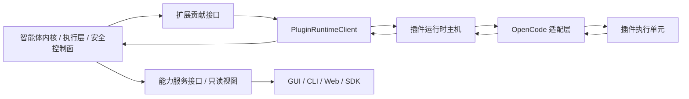
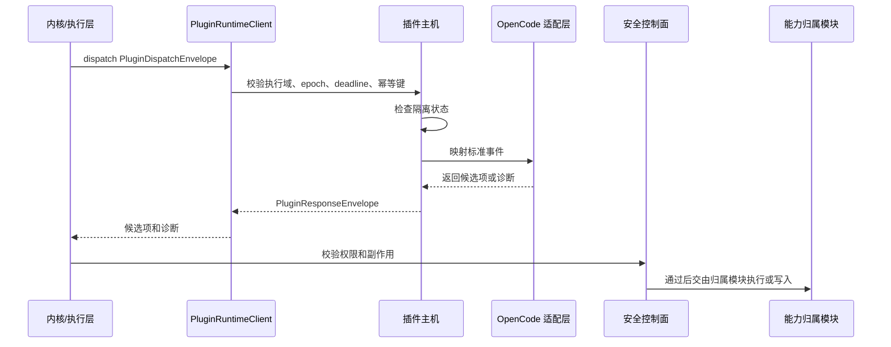

# 插件运行时主机与 OpenCode 适配层设计

本文件补充 [`product-architecture.md`](product-architecture.md)。产品入口、前后端 DTO 和产品形态状态词以主架构文档为准；本文件只定义插件运行时主机内部 ABI、主机职责、OpenCode 适配边界和验证要求。

## 1. 职责定位

插件运行时主机位于 BitFun 扩展贡献接口之后、插件执行单元之前。它负责隔离插件执行、分发标准事件、收集候选项、记录诊断、维护隔离状态和保护默认任务路径。

插件运行时主机不是：

- 产品入口协议。
- SDK 门面。
- 第二个智能体内核。
- OpenCode 运行时复制品。
- 权限、审计、工具结果或界面状态的权威写入方。



关键边界：

- 产品表层入口、前端和命令只能消费能力服务接口和只读视图，不直接调用 `PluginRuntimeClient`。
- 产品运行时归属模块或组装后的主体进程访问主机时，只能通过 `PluginRuntimeClient` 和标准 read/dispatch 请求与响应对象。
- 适配器只在主机内部出现；主体进程不得按 `OpenCodeAdapter` 等具体类型分支。
- OpenCode 原始 payload 只存在于适配器内部，跨出适配层前必须转换为 BitFun 来源、诊断、候选项或类型化 unsupported。

## 2. 主机内部 ABI

当前主机内部 ABI 的唯一代码主入口是 [`src/crates/contracts/runtime-ports/src/plugin.rs`](../../src/crates/contracts/runtime-ports/src/plugin.rs)。根 re-export 受 `scripts/core-boundaries/rules/source/public-api-rules.mjs` 的公开接口预算约束；每个公开符号必须声明消费方、验证目标、线缆影响和 `contractSlice`。

| 对象 | 作用 | 稳定范围 | 禁止承载 |
|---|---|---|---|
| `PluginRuntimeClient` | 主体进程调用插件主机的窄接口 | `availability`、`read_plugins`、`dispatch` | install/enable UI 动作、具体适配器、worker 句柄、服务管理器 |
| `PluginRuntimeBinding` | 产品组装注入 disabled、projection-only 或 sealed client | 组装期绑定和降级事实 | 自动启动完整产品、隐式启用插件运行时 |
| `PluginRuntimeAvailability` | 主机可用性事实 | disabled、projection-only、available、unavailable | 前后端最终状态词原样泄漏 |
| `PluginRuntimeReadRequest/Response` | 插件状态、诊断和隔离只读视图 | 只读视图和诊断 | 用户可执行恢复动作、生态原始配置 |
| `PluginDispatchEnvelope` | 主体进程向主机投递标准事件 | event type、extension point、source、capability、deadline、epoch、payload ref | 原始 JSON payload、UI DTO、最终权限或工具结果 |
| `PluginResponseEnvelope` | 主机返回候选项和诊断 | 候选项、诊断、隔离、状态视图、epoch | accepted bool、授权写入、审计写入、工具结果写入 |
| `PluginEffectCandidate` | 插件贡献的候选项 | 当前只承载提供方候选（`ProviderCandidate`） | final result、permission granted、audit written、state changed |
| `PluginDiagnostic` / `PluginQuarantineState` | 诊断和隔离事实 | 类型化原因、范围、清除条件、诊断引用、审计引用 | 本地化文案作为唯一事实、不可解析错误、恢复动作 |

主机 ABI 不包含 `UiContributionDescriptor`、OpenCode client/server facade、shell helper、泛 hook registry、TUI/GUI 主题键或完整生态能力矩阵。
相关能力进入后续 PR 前，必须映射到已有工具、事件、权限子接口，或已预算的入口形态声明接口，并具备目标入口形态、消费方和验证路径。主机 ABI 不承载界面实现、渲染句柄或跨入口主题键。

`ProjectionOnly` 表示主机只返回只读视图、诊断或受权限门禁保护的候选项；插件代码没有被执行，最终工具结果、权限结果和审计写入也没有提交。

## 3. P0-B 与 P0-C 边界

| 阶段 | 交付内容 | 明确不交付 |
|---|---|---|
| P0-B | 主机内部 ABI、产品形态保护、read/dispatch 校验、deadline、epoch、幂等、隔离、诊断、`HostRestarted` 清除路径 | Desktop/CLI 插件消费、来源发现、激活、副作用执行、用户可执行恢复动作、界面贡献载荷 |
| P0-C.1 | BitFun 受管插件包发现、完整性校验、工作区信任和 CLI 诊断 | 插件执行、生产主机绑定、安装复制、随产品携带包和外部 OpenCode 目录导入 |
| P0-C.2 | OpenCode-compatible 最小映射和一个真实候选项消费路径 | 完整 OpenCode 运行时、外部 OpenCode CLI 前置依赖、全入口界面扩展矩阵、任意可写 hook |
| P0+ | Server/Remote/ACP/SDK 受控运行、更多 OpenCode hook、界面贡献、跨生态兼容 | 让外部生态接口成为 BitFun 内部归属接口 |

P0-B 的完成标准只能证明主机边界安全，不能宣称 OpenCode-compatible 产品体验完成。
P0-C.1 只证明 BitFun 可以识别、校验和审核受管包；P0-C.2 才覆盖 custom tool 候选项消费。完成 P0-C.1 不表示插件已启用或可执行。

## 4. OpenCode 适配边界

OpenCode 适配层是主机内部的兼容适配层。它读取 OpenCode 配置和插件文件，输出 BitFun 主机接口对象或诊断。

| OpenCode 输入 | BitFun 输出 | 当前边界 |
|---|---|---|
| `opencode.json` plugin 配置 | 导入 provenance、manifest、hash、诊断、候选 BitFun 来源 | 可选导入，不执行 |
| `.opencode/plugins/*.js|ts` | 候选来源、配置诊断、能力诊断 | 不直接加载为权威状态 |
| 全局插件目录 | 候选来源和冲突诊断 | 不继承 OpenCode 启用顺序 |
| custom tool | `PluginEffectCandidatePayload::ProviderCandidate` | 进入最终工具链路前必须走工具 ABI 和权限门禁 |
| permission hook | `PluginPermissionGate::PermissionRequired` 或诊断 | 不能直接批准 |
| `tool.execute.before/after` | 当前阶段诊断或 status-only | 不改写工具输入或结果 |
| events / SSE | 公开事件清单的受控订阅声明 | 不读取内部事件结构 |
| TUI/GUI 界面贡献 | P0-B 返回 unsupported/status-only；P0-C/P0+ 需真实入口消费方、目标入口形态和主题语义 token 映射 | 不暴露可执行界面代码、渲染句柄或跨入口原始主题键 |
| shell helper | 默认 unsupported | 未来只能成为受控工具请求候选 |

OpenCode-compatible 表示文件形态和插件能力可被识别并映射，不表示：

- 用户必须安装 `opencode` CLI。
- BitFun 复刻 OpenCode 配置系统。
- OpenCode 的权限、启用顺序或插件状态成为 BitFun 权威状态。
- BitFun 为 OpenCode 暴露独立产品入口接口。

入口形态规则：

- 主机只接收目标入口形态、能力声明和候选项，不解释 TUI 键位、GUI 路由、CSS 变量或终端颜色键。
- TUI 只能消费命令、键位、状态/通知、主题语义 token 和只读状态；GUI 只能消费路由、面板、槽位、对话框、提示、主题语义 token 和只读状态。
- 主题键差异由对应入口宿主的映射表处理；插件主机不得把 GUI 主题键透传给 TUI，也不得把 TUI 键位或终端颜色键透传给 GUI。

## 5. 生命周期与隔离



隔离规则：

- 插件失败、超时、旧 epoch、非法响应或策略拒绝只能产生诊断、隔离或候选丢弃。
- 主机不得伪造权限通过、工具成功、审计成功或产品状态变更。
- `HostRestarted` 是 P0-B 唯一清除条件；用户可执行清除、重试、重新信任和打开日志等动作必须等 P0-C/P0+ 有归属端口、审计事实和真实消费方后再暴露。
- `restart(project_domain_id, workspace_id)` 是内部清理路径，用于清除对应执行域的隔离、诊断只读视图和幂等缓存。

## 6. 目录与来源原则

P0-C.1 只读取两个 BitFun 受管目录：用户数据目录的 `plugins` 和项目目录的 `.bitfun/plugins`。工作区同 ID 包覆盖用户包。包目录名必须与 `bitfun.plugin.json` 的 `id` 一致；清单声明文件及其哈希构成来源标识。信任记录按本地项目与工作区作用域存放在用户运行数据目录，不写回项目或插件包。

`adapter` 是来源模块不解释的小写标识；`opencode_compatible` 包的入口和能力只由 OpenCode 适配层解释。当前来源模块不扫描用户的 `opencode.json`、全局 OpenCode 目录，也不要求 `opencode` CLI 存在。外部目录导入、随产品携带包、安装复制和卸载属于独立产品流程；接入后仍必须转换为相同的 BitFun 包来源和信任输入。

版本 1 包清单示例：

```json
{
  "schemaVersion": 1,
  "id": "acme.demo",
  "version": "1.0.0",
  "adapter": "opencode_compatible",
  "files": [
    {
      "path": ".opencode/plugins/demo.ts",
      "sha256": "sha256:<64 lowercase hex characters>"
    }
  ]
}
```

- `id` 以小写字母或数字开头，只允许小写字母、数字、`.`、`-`、`_`；`adapter` 以小写字母开头并使用同一字符集合。
- 清单文本字段拒绝控制字符；CLI 在输出包路径和诊断前再次转义控制字符。
- 文件路径必须相对包根目录，不能包含 `.`、`..`、反斜杠或盘符。来源标识和后续适配器访问范围只包含清单声明文件；未声明文件不进入审核范围，也不得被适配器读取或执行。
- 单文件、包总量、一次来源刷新或审核操作的总读取字节、总扫描时间和信任文件均有固定上限；校验失败或部分失败的读取同样计入操作预算，二次稳定性扫描不得重置预算。符号链接、Windows reparse point 和越出受管根目录的路径按错误处理。
- 工作区包存在时，用户级同 ID 包及其诊断归一化为 `shadowed_package`；工作区包无效时也不得回退。
- 本地项目 ID、工作区 ID 和来源标识基于平台原生路径摘要生成，避免非 UTF-8 或非法 UTF-16 路径经有损转换后共享信任；Remote、Server 或组织项目必须提供自己的身份来源。
- 信任文件按平台原生工作区路径摘要隔离并存放在用户运行数据目录。BitFun 进程的完整读改写使用同一文件锁；锁等待受操作期限约束，阻塞写入任务持锁直至替换与同步完成，调用 future 取消不能提前释放锁。写入使用同目录临时文件、大小上限、Windows 备份恢复和平台原子替换；提交前复核文件身份，替换完成但目录同步失败时明确报告“状态已写入但持久性不确定”。该锁只协调遵守同一锁文件的 BitFun 进程，不承诺阻止其他进程直接篡改用户信任文件；外部修改在后续读取时按文件身份或内容校验结果处理。文件重建时使用新的随机初始 epoch；扫描不完整时保留原记录但不返回 `SourceApproved`，也不允许写入新决定。
- 具体文件系统校验和信任持久化归 `services-integrations/plugin_source`，`bitfun-core/plugin_source` 只注入产品目录并保留兼容接口。
- 产品路径初始化失败或全局路径管理器已降级到临时目录时，来源列表、审核和 `doctor` 必须返回错误，不得在临时目录中创建信任记录。
- 产品域的 `SourceApproved` 只确认来源内容，不依赖 Host ABI，也不得直接映射为 Host 的 `Trusted`。P0-C.2 首次激活必须展示适配器、入口、能力和副作用并重新确认。
- P0-C.2 加载器不得复用 CLI 扫描结果直接执行文件；绑定前必须把清单声明文件重新校验并固定为不可变快照，dispatch 前还必须校验来源标识、激活确认和 Host 信任 epoch。

## 7. 验证要求

最小验证目标：

- `cargo test -p bitfun-runtime-ports --test plugin_runtime_contracts`
- `cargo test -p bitfun-runtime-ports --test plugin_runtime_host_contracts`
- `cargo test -p bitfun-plugin-runtime-host`
- `cargo test -p bitfun-product-domains --test plugin_source_contracts --features plugin-source`
- `cargo test -p bitfun-services-integrations --no-default-features --features plugin-source plugin_source --lib`
- `cargo test -p bitfun-cli --test plugin_source_cli`，在隔离用户目录和临时工作区验证真实 `list/approve-source/deny/revoke/doctor` 生命周期与退出码。
- `cargo test -p bitfun-opencode-adapter --test opencode_source_adapter`，证明 OpenCode 输入可通过 Host adapter 转换为 BitFun 来源只读视图和诊断只读视图；未建立信任的来源只返回诊断和只读状态，不进入工具候选链路。
- `cargo test -p bitfun-opencode-adapter p0_c2_fixture` 保护可信源 custom tool 到 `PluginEffectCandidatePayload::ProviderCandidate` 的候选映射、权限提示和工具 ABI 标识。
- `cargo test -p bitfun-opencode-adapter host_path_projects_trusted_custom_tool_candidate_with_permission_prompt` 保护可信 custom tool 候选在 `PluginRuntimeHost` dispatch 路径下仍通过权限门禁和响应契约校验。
- `node scripts/check-core-boundaries.mjs`

PR 审查重点：

- 是否新增无消费方的公开接口。
- 是否绕过公开接口预算。
- 是否把 OpenCode 概念提升为 BitFun 内部归属模块。
- 是否让产品入口直接消费 host ABI。
- 是否新增可写 hook、shell/env helper、界面贡献或多生态兼容能力，但没有真实消费方和安全评审。
