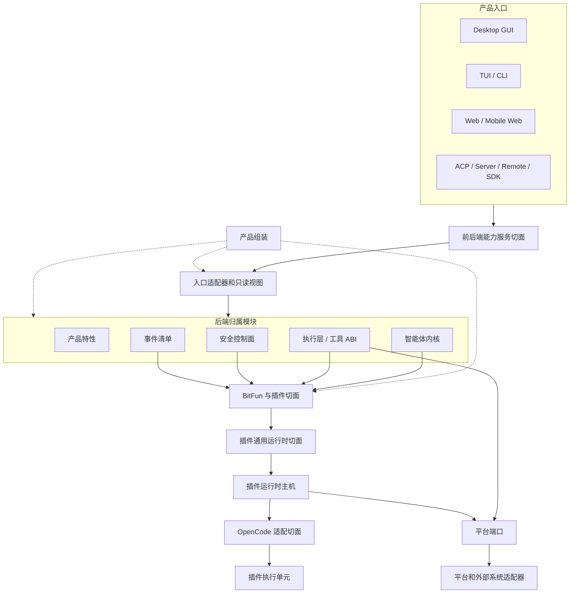
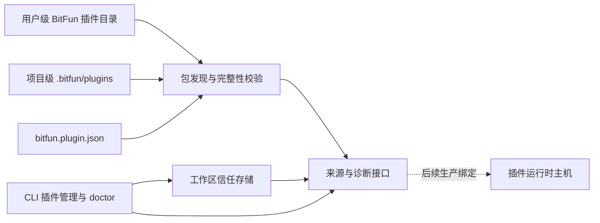

# BitFun 产品运行时架构

本文件定义 BitFun 产品运行时的稳定架构边界。详细执行计划见
[`../plans/core-decomposition-plan.md`](../plans/core-decomposition-plan.md)；智能体内核、运行时服务和 crate
约束见 [`agent-runtime-services-design.md`](agent-runtime-services-design.md)；插件运行时主机内部 ABI 和生态适配细节见
[`plugin-runtime-host-design.md`](plugin-runtime-host-design.md)。详细设计与本文件冲突时，以本文件为准。

本文件只约束稳定边界，不记录单次 PR 进度，也不把未来可能支持的生态能力提前声明为公开接口。

## 1. 架构目标

BitFun 同时面向桌面 GUI、TUI/CLI、Web、ACP、Server、Remote、SDK 和插件生态。架构目标是降低后端实现高频变更对稳定接口的影响，同时保持插件生态和 OpenCode-compatible 能力可以按受控路径扩展。

设计原则：

1. **接口少而稳定**：每个切面只有一个主入口；不能因为新增生态适配或实现重构而新增平行接口。
2. **实现不外溢**：运行时、平台服务、生态适配器、插件执行单元和传输实现只能通过稳定接口、只读视图或内部 ABI 被消费。
3. **扩展先声明，最终写入归属模块**：插件、钩子和工具提供方先产出声明或候选项；最终权限、审计、工具结果和状态写入由归属模块完成。
4. **OpenCode 是适配输入，不是内部模型**：OpenCode plugin、hook、custom tool、permission hook 和配置目录只能映射到 BitFun 接口，不能反向定义 BitFun 的内部接口。
5. **公开接口有预算**：新增公开 DTO、trait、模块或门面必须同时具备归属模块、真实消费方、版本策略、验证方式和退场条件。
6. **入口形态受宿主约束**：TUI、GUI、Web 和 SDK 共享能力服务接口和只读视图，不共享渲染句柄、主题键、键位模型或界面状态；插件界面贡献必须先声明目标入口形态，再由对应宿主适配。

调用路径长度只作为工程成本处理，不作为独立架构目标。允许保留承担兼容隔离、只读视图或能力选择职责的中间层；不允许为了兼容而长期暴露没有消费方的抽象接口。

## 2. 接口切面

BitFun 只保留四个稳定接口切面；工具、事件和权限作为归属子接口被复用，不在插件层重复定义。本文使用“接口”描述可被调用或依赖的能力面；只有描述跨进程消息封装、结构化 schema、序列化对象或强兼容约束时才使用“契约”；只读状态视图表示从权威状态派生出的查询结果。

| 切面 | 主要消费方 | 主入口 | 稳定内容 | 禁止暴露 |
|---|---|---|---|---|
| 前后端能力服务切面 | GUI、TUI/CLI、Web、ACP、Server、Remote、SDK 客户端 | 能力服务接口 | 命令请求、会话/工作区状态、权限提示、诊断、产物引用、能力状态、事件流、类型化错误、插件状态只读视图 | 内核状态机、执行层内部类型、`PluginRuntimeClient`、主机状态快照、生态原始载荷、Tauri/React/TUI 实现、具体服务提供方、未预算的界面贡献接口 |
| BitFun 与插件切面 | 插件运行时主机、安全控制面、产品组装、生态适配器 | 扩展贡献接口 | 插件来源、信任、能力/副作用声明、事件订阅声明、工具贡献、受控 hook 候选、权限候选、诊断、隔离事实 | 最终权限结果、最终工具结果、审计写入、内核权威状态、前后端线缆 DTO、界面实现代码 |
| 插件通用运行时切面 | 智能体内核、执行层、产品组装、插件运行时主机 | 主机内部 ABI | `PluginRuntimeClient`、`PluginRuntimeBinding`、read/dispatch 请求与响应对象、deadline、epoch、幂等、隔离、诊断、候选项 | SDK 门面、前后端接口、生态适配器对象、worker/subprocess 句柄、产品入口状态 |
| OpenCode 适配切面 | 插件运行时主机内部 | 兼容适配层 | OpenCode plugin/config/tool/hook/event 的解析、诊断和 BitFun 接口映射 | 独立产品入口、OpenCode 原始类型、外部 OpenCode CLI 依赖、OpenCode 配置作为 BitFun 主配置 |

归属子接口：

| 子接口 | 归属 | 用法 |
|---|---|---|
| 工具 ABI | `tool-contracts` / 执行层 | 插件 custom tool、MCP 工具和内置工具都进入同一工具快照、权限和陈旧调用保护路径。 |
| 事件清单 | `events` / 智能体内核事件 schema | 插件只能订阅公开事件清单的受控子集；不得读取会话、轮次或工具内部结构。 |
| 权限与副作用 | 安全控制面 / runtime ports | 插件只能提交权限候选或副作用候选；最终裁决、审计和状态写入属于安全控制面和能力归属模块。 |

### 2.1 公开接口准入规则

新增或保留公开接口必须满足以下条件：

1. 属于上表一个明确接口切面；公开接口进入预算时必须在 `scripts/core-boundaries/rules/source/public-api-rules.mjs` 声明 `contractSlice`，该字段只用于机器校验接口归属，不能同时承担前后端线缆、插件扩展、host ABI 和生态适配职责。
2. 有当前消费方；仅为了未来兼容、完整矩阵或概念完整性保留的接口不进入稳定面。
3. 能映射到 OpenCode-compatible P0 关键场景，或属于 BitFun 已有关键路径的稳定子接口。
4. 不能由既有工具 ABI、事件清单、权限控制面或能力服务接口承接时，才允许新增。
5. PR 必须说明版本影响、验证命令和退场条件。

没有 OpenCode 对应能力、没有当前消费方、不能归入关键 BitFun 场景的接口，处理方式只有三种：删除、降级为主机内部实现，或返回类型化 `unsupported` / 诊断。

### 2.2 入口形态接口规则

入口形态接口只描述宿主可消费的声明，不描述具体渲染实现。TUI 与 GUI 的能力边界不同，不能因为存在一个界面插件就自动扩展为全入口稳定接口。

| 目标入口形态 | 可进入稳定接口的内容 | 必须由宿主决定 | 禁止进入插件接口 |
|---|---|---|---|
| TUI / CLI | 斜杠命令、键位候选、状态行/通知候选、终端主题语义 token、只读状态视图 | 键位冲突处理、终端能力降级、ANSI/truecolor 映射、文本回退 | React/DOM/Tauri 句柄、CSS token、GUI 布局、可执行界面代码 |
| Desktop GUI / Web | 路由、面板、槽位、对话框、提示、GUI 主题语义 token、只读状态视图 | 组件装载位置、布局约束、焦点与可访问性、设计 token 映射 | 终端键位、ANSI 颜色、TUI 状态行键、宿主组件实例 |
| SDK / Server / Remote / ACP | 状态、诊断、能力清单、类型化 `unsupported` | 是否暴露只读状态或降级原因 | 任意界面贡献、主题键、渲染句柄 |

主题贡献只能声明语义角色和目标入口形态，例如 `accent`、`danger`、`surface`、`text`、`border`。TUI 宿主把语义角色映射为终端颜色、ANSI 或 truecolor；GUI 宿主把语义角色映射为设计 token 或 CSS 变量。若插件只提供 GUI 主题键而当前入口是 TUI，系统只能使用语义回退或返回类型化 `unsupported`，不得把 GUI 主题键直接传给 TUI。

## 3. 运行视图

关键规则：

- 产品入口只消费能力服务接口和只读视图，不直接调用插件主机。
- 插件只进入扩展贡献接口，不直接写内核状态、工具结果、权限结果或审计事实。
- 插件运行时主机只负责隔离通信、deadline、幂等、诊断、隔离和候选项路由。
- OpenCode 适配层只做解析、诊断和映射；不成为 BitFun 内部真实归属模块。
- 产品组装是组装根，只在组装期选择能力、服务实现、插件运行时绑定和降级策略。

## 4. OpenCode-compatible P0 边界

P0 的目标不是复制完整 OpenCode 运行时，也不是导入用户已有 OpenCode 安装。P0 只验证一条 BitFun 主导的 OpenCode-compatible 插件路径。

当前 P0-C.1 只建立包识别、完整性校验、工作区信任和 CLI 诊断，不执行插件：

1. 用户级包和项目级包只从 BitFun 受管目录发现；工作区同 ID 来源优先且不得回退到用户级包。
2. `bitfun.plugin.json` 只定义生态无关的包来源标识、适配器标识和文件哈希；具体生态入口由对应适配器解释。
3. `bitfun-cli plugins` 提供来源审核和诊断；`SourceApproved` 只确认当前来源内容，不表示能力已批准、已启用或可执行，完整性错误由 `bitfun-cli doctor` 返回失败。
4. 当前来源接口未绑定生产插件主机，不执行 JS/TS，不注册最终工具。目录、清单和持久化规则见 [`plugin-runtime-host-design.md`](plugin-runtime-host-design.md#6-目录与来源原则)。

归属边界：`product-domains/plugin_source` 定义纯数据和信任规则，`services-integrations/plugin_source` 负责文件系统校验、锁和持久化，`bitfun-core/plugin_source` 仅注入产品目录并保留 CLI 兼容接口。

当前实现与后续能力边界：

| 能力 | 当前实现 | 后续工作 |
|---|---|---|
| 用户级、项目级包 | 从两个 BitFun 受管目录发现并校验 | 安装复制、更新、卸载和组织策略 |
| 随产品携带包 | 未建立独立扫描根 | 由构建配置、安装器和产品组装提供来源后接入同一校验接口 |
| OpenCode 兼容内容 | 包清单可声明 `opencode_compatible`，来源模块只验证清单声明文件 | OpenCode 适配器解释包内布局；外部目录需独立导入流程 |
| 来源审核 | 工作区 `SourceApproved`、`Denied`、`Revoked`；内容变化使旧审核失效，新来源标识回到 `Unknown` | 首次激活能力审核、组织策略、签名和撤销列表 |
| 插件运行 | 不执行 JS/TS，不注册最终工具 | 通过 `PluginRuntimeBinding` 接入主机，再完成工具 ABI 消费路径 |

OpenCode 适配接入规则：

- OpenCode 适配器通过插件运行时主机暴露来源只读视图、诊断和受信任 custom tool 候选映射。
- 信任输入复用既有 `PluginSourceRef` 来源快照，并携带产品来源/策略侧生成的信任 epoch；信任 epoch 必须与本次 read/dispatch epoch 一致。
- 未支持或信任不足的能力必须返回诊断或 `unsupported` 状态，不得因外部插件内容导致运行时崩溃。
- 生产产品组装接入必须通过 `PluginRuntimeBinding` 注册适配器，并在同一变更中同步边界脚本、主机路径测试和启用/降级策略。
- GUI、TUI/CLI、Web 等产品入口只消费能力服务接口、插件只读视图、诊断和稳定状态词，不直接依赖 OpenCode 适配器内部类型或插件主机内部 ABI。

信任 epoch 与生命周期：

- 来源审核 epoch 由 BitFun 来源与信任模块维护。审核、拒绝、撤销、已有记录的来源标识或哈希变化都会推进 epoch；重复写入相同决定不推进 epoch。信任文件重建时使用新的随机初始值，避免旧 epoch 被重复使用。
- 发现的新来源默认为 `Unknown`；CLI 只允许对当前工作区已发现且 id 唯一的包写入 `SourceApproved`、`Denied` 或 `Revoked`。
- 损坏、版本未知或记录冲突的信任文件按失败处理；适配器和主机不得写信任状态。
- `SourceApproved` 不得直接映射为 Host 的 `Trusted`。P0-C.2 首次激活必须展示适配器、入口、能力和副作用并重新确认；只有该确认产生的 Host 信任且 epoch 匹配时才可生成 custom tool 候选。
- `ProjectionOnly` 在候选路径中表示插件代码没有被执行、最终效果没有提交；它允许主机返回受权限门禁保护的候选项和诊断，不表示插件运行时已经可执行。

OpenCode 能力映射：

| OpenCode 能力 | BitFun P0 处理 | 不允许 |
|---|---|---|
| project/global plugin config | 可选导入源，产出 provenance、manifest、hash、诊断和候选 BitFun 来源 | 作为 BitFun 主配置或直接决定启用状态 |
| custom tools | 映射为工具提供方候选，最终走工具 ABI | 新增插件专用工具模型 |
| permission hooks | 映射为权限候选或需要确认的诊断 | 插件直接批准、拒绝或写审计 |
| events / SSE | 订阅 BitFun 公开事件清单的受控子集 | 读取内部 session、turn、tool 或 UI 状态 |
| tool execute before/after | 当前阶段只允许诊断或只读候选；可写变换必须进入 P0+ 安全评审 | 改写工具结果、伪造成功或绕过权限 |
| TUI 命令/键位/主题 | 当前 P0 返回类型化 `unsupported` 或 status-only；后续必须通过目标入口形态为 `tui` 的声明式接口进入 | 复用 GUI 路由/面板/槽位、暴露终端渲染句柄、直接消费 GUI 主题键 |
| GUI 路由/面板/对话/主题 | OpenCode P0 不提供稳定来源；后续只能作为 BitFun GUI 入口的声明式贡献进入 | 复用 TUI 键位/状态行、暴露 React/DOM/Tauri 句柄、直接消费 TUI 主题键 |
| shell/env helper | 默认不开放；未来只能映射为受控工具请求候选 | 无约束 shell、环境变量或 localhost 能力 |

不进入当前阶段：

- 完整 OpenCode 运行时兼容。
- 要求用户本机安装 `opencode` CLI。
- 对 Claude Code、Codex 等生态声明稳定运行时接口。
- 全入口 UI 扩展矩阵。
- 任意 provider/model/config 转换。
- 无约束 JS/TS runtime、localhost 接口或可写 hook。
- 对外稳定 SDK 发布。

## 5. 产品形态与降级

产品形态由产品组装决定，不由插件配置、单个 Cargo feature 或生态适配器临时决定。

| 产品形态 | P0 插件策略 | 入口行为 |
|---|---|---|
| Desktop / product-full | 当前仅保留插件主机基础边界，尚未绑定受管包来源 | 生产绑定完成前不得把来源审核通过的包显示为已启用或可执行 |
| CLI | 提供受管包来源审核和诊断入口，不启动插件主机 | `plugins list` 显示两个扫描根、适配器、来源、hash、审核状态和执行不可用；`doctor` 对完整性错误返回失败 |
| ACP | `status-only`、`projection-only`、`unsupported`、`policy-denied` 或 `quarantined` | 不把插件失败解释为 agent 失败，不接入 P0 副作用闭环 |
| Server / Remote | `projection-only`、`temporarily-unavailable`、`unsupported` 或 `policy-denied` | 不自动启动本地 JS/TS 运行时；远端执行域需 P0+ 单独设计 |
| Web / Mobile Web | 只消费后端能力服务接口和只读视图 | 不持有插件执行单元，不直接加载插件代码 |
| SDK | 默认 disabled stub 或测试替身 | 不牵引 `product-full`、具体服务管理器或插件 host ABI |

稳定状态词限制为：`available`、`projection-only`、`status-only`、`temporarily-unavailable`、`unsupported`、`policy-denied`、`quarantined`。其他内部状态必须先归一化为这些状态词或类型化错误。

## 6. 完成判定

架构或实现 PR 必须满足：

- 未新增无消费方的公开接口、空注册表、泛描述符或多生态稳定接口。
- 没有把 OpenCode 类型、配置、加载顺序或 CLI 可用性提升为 BitFun 权威状态。
- 插件贡献不能写最终权限、审计、工具结果或内核状态。
- 前后端入口不能消费 `PluginRuntimeClient`、host 快照、生态原始载荷或插件执行单元句柄。
- 工具、事件、权限能力优先复用既有归属子接口，不在插件层重复建模。
- TUI 与 GUI 不共享主题键、键位模型或界面状态；跨入口能力只能通过语义 token、只读视图和对应宿主适配。
- 文档、边界脚本和 focused 测试能说明本次变更保护了哪个稳定接口切面，或删除/降级了哪个过宽接口。
